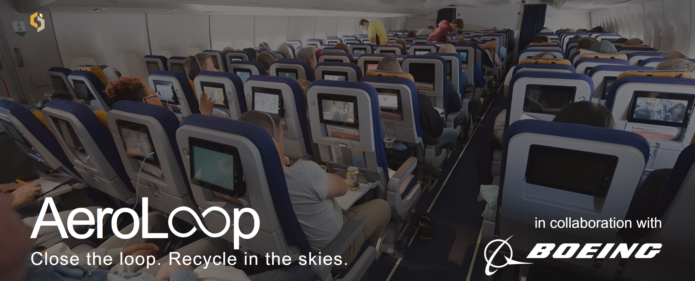
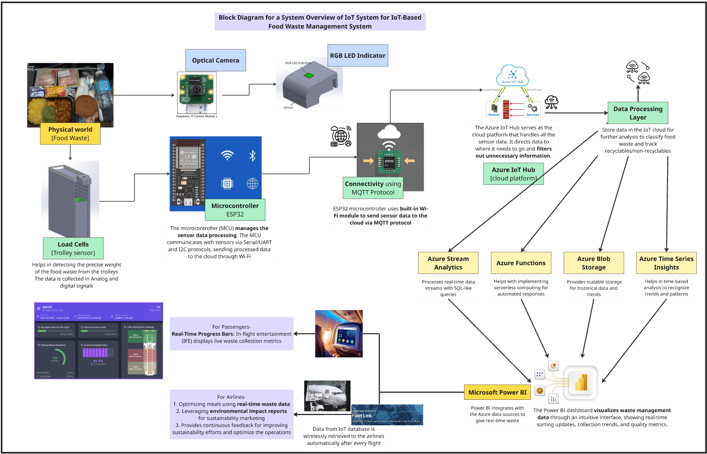
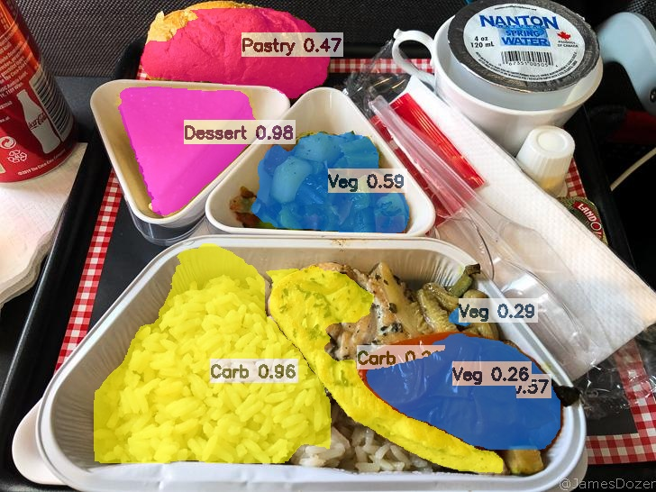

# AeroLoop
A waste management system to **salvage on-flight recyclables** on commercial flights, optimised for **minimal energy use, hardware cost and weight added** to aircraft, designed for the purpose of seperating International Catering Waste (ICW) from non-ICW, so that recyclables **do not have to be incinerated or landfilled**.

# System Architecture



# Component 2 of AeroLoop: Airline Meal Computer Vision Project
This github contains files to train a Computer Vision Image Segmentation model from scratch for deployment on Jetson Nano (4GB), making use of free features on the Roboflow platform.
## Process:
### On Windows 11 Local Computer
1: <ins>**Collect dataset**</ins> (using a phone/digital camera) <br>

2: <ins>**Label** </ins> images collected on Roboflow, and since this is image segmentation, do this by drawing polygons over objects. Use Roboflow's Smart Polygon tool to do this. [Link to labelled Roboflow Dataset](https://app.roboflow.com/boeing-yqqas/computer-vision-project-fonhr/models)<br>

<p align="center">
  <br>
  <i>Image Segmentation on Roboflow</i>
</p>

3: Make use of Roboflow's functions to add <ins>**Data Augmentation**</ins> on current dataset to expose model to visual variability of classes (brightness, size, rotation/orientation of objects, saturation, occlusion etc.) <br>

4: <ins>**Download the zipfile**</ins> containing your labelled dataset's annotation.json files (details the polygons you have just drawn on the images for Image Segmentation) and images from Roboflow by choosing to download as **COCO Image Segmentation**.

5: Open terminal on local computer to run and use coco_to_yolov8nseg.py script (file in this github repository) to **<ins>convert COCO Image segmentation zipfile's annotation.json to yolov8 labels.</ins>** <br>

6: Create <ins>**data.yaml**</ins> file according to the file in this git repository. <br>

7: <ins>**<ins>Train YOLOv8n Model which outputs as .pt format</ins>**</ins> using data.yaml, labels outputted from coco_to_yolov8nseg.py and images from your dataset using the following command: <br>

```
yolo task=segment mode=train model=yolov8n-seg.pt data=dataset.yaml epochs=100 imgsz=640 # this command also forces ‘yolov8n-seg.pt model to be downloaded so that the model can be trained
```

This is the most time-consuming part of the whole process, took about 2 hours for a data set of 500+ images. <br>

8: <ins>**Convert</ins> .pt model to INT32 (INT32 is simplified) .onnx model** using this command:
```
yolo export model="C:\Users\grace\runs\segment\train2\weights\best.pt" format=onnx simplify=True
```
Choose simplify=True because later on, the trtexec command on Jetson that one will run later on will only be able turn onnx models that is INT32 into .engine models, it cannot turn INT64 onnx models into .engine models. <br>

### On Jetson Nano (4GB)
9:  Run this command on the Jetson Nano 4GB to **<ins>convert</ins> .onnx model into .engine model** serialised on and optimised for the particular Jetson machine we have. <br>

```
/usr/src/tensorrt/bin/trtexec --onnx=/home/grace/Templates/models/4best.onnx --saveEngine=/home/grace/Templates/models/4best.engine
```

This command must be run on the SAME Jetson that we are using to run inference, this is a must for serialisation of .engine model. <br>

10: <ins>**Use .engine model to run inference**</ins> on images saved on the Jetson Nano (4GB) using the script engine_inference.py (file in this github repository) and this command. <br>

```
LD_PRELOAD=/usr/lib/aarch64-linux-gnu/libgomp.so.1 python3 engine_inference.py --engine /home/grace/Templates/models/4best.engine --input /home/grace/Templates/images/batch1_14.jpg --output /home/grace/Templates/images/batch_14_output.jpg
```

<p align="center">
  <br>
  <i>Output Image from running engine_inference.py on Jetson Nano (4GB)</i></br>
</p>

11: **Assess accuracy** **latency**, and **retrain model by going back to step 1 and adding images of under-represented classes to Roboflow dataset** if accuracy <95% or if latency is not desirable. <br>


# Repository contains files for ML training:
1. coco_to_yolov8n.py — **Python Script** used to convert COCO annotation.json exported from Roboflow into YOLOv8n labels needed for training of YOLOv8n models.
2. data.yaml - **.yaml file** needed for training of YOLOv8n model using the terminal command above.
3. engine_inference.py -  **Python Script** for Nvidia Jetson Nano (4GB) to **run inference** on images captured by Raspberry Pi camera using a .engine model.
4. frontend_ipad.html and backend.py - Generate flight_details .json file containing destination to enable cabin crew to **dynamically change** Jetson Nano's output result **according to destination** and possibility of changes to ICW regulations.
5. run_pt_inference_load_once.py - **Python Script** to run inference on an image using .pt model (use to benchmark .engine model against .pt model, see if there are any drastic differences in accuracy or latency)


