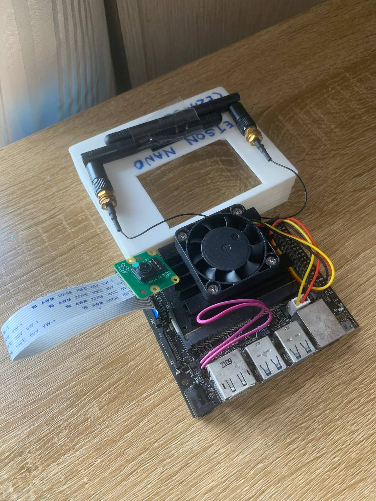

# AeroLoop
A waste management system to **salvage on-flight recyclables** on commercial flights, optimised for **minimal energy use, hardware cost and weight added** to aircraft, designed for the purpose of seperating International Catering Waste (ICW) from non-ICW, so that recyclables **do not have to be incinerated or landfilled**.

# System Architecture

# Component 2 of AeroLoop: Airline Meal Computer Vision Project
| Benchmarks the Machine Learning model trained must meet | Measures Undertaken |
|--|--|
| Image capture and processing pipeline must be optimised for **fine-grain pixel detection**, as food bits on meal trays might be too small (too few pixels) for detection. | - Use **Tiling** and **optimised resolution**: 640×640 + tiling (split each image captured by Raspberry Pi Cam into 3×3 tiles, then run inference on each of the 9 images)   - Use Yolov8n's **AutoAnchor feature** to define what sizes/shapes of objects the model expects, enable it to lock onto tiny food bits automatically   -Set **confidence interval to a lower value** (eg. 15%) makes the model surface weaker, low-confidence objects  
| Response time **must be <2s** so as to not delay tray collection by cabin crews. | Chose Nvidia Jetson Nano (4GB) for a safe margin of processing speed   - Export Yolov8n as lightweight format of TensorRT to maximise speed of inferences made  | 
| Able to **distinguish between more than 2 food classes**, not just ICW and non-ICW, as different countries have different ICW regulations (eg. fruits are ICW in US, while not in EU). This is so that we would  be able to output the correct LED light (green/red) according to the country of destination. | **Image Segmentation** (See Below)

## Labels
1. Meat Bits
2. Vegetable Bits
3. Fruit Bits
4. Dessert Leftover
5. Meat
6. Vegetable
7. Fruit
8. Dessert

# Process of training ML Model
1: **Collect dataset** (using a phone/digital camera)  
2: **Label** images collected  

   
  <i>Image Segmentation on Roboflow</i>

3: Do **Data Augmentation** on current dataset to expose model to visual variability of tiny food bits (lighting, size, angle, occlusion)  
4: **Train Model** (On laptop, Colab Notebook)  
5: **Export** trained model (.tflite (for TensorFlow Lite) after **quantisation (convert to INT8)** and **pruning**, **upload** to Nvidia Jetson Nano (4GB)  
6: Implement **Image Capture pipeline** (Add **tiling** step, optimise **resolution**, and **AutoAnchors**)  
7: Run inference on Jetson NanoRun real-time inference with Raspberry Pi Camera Module v2, **assess accuracy**, **retrained** if accuracy <95%.  

   
  <i>Wireless Nvidia Jetson Nano (4GB) Setup</i> 

# Repository contains files for running ML Model on Jetson Nano:
1. YOLOv8_Training_Colab.ipynb — **Colab notebook** used to train dataset
2. inference.py -  Script for Nvidia Jetson Nano (4GB) to **run inference** on images captured by Raspberry Pi camera
3. utils.py: **Helper script** for tiling images (3×3) to improve detection of tiny food bits
4. frontend_ipad.html and backend.py - Generate flight_details .json file containing destination to enable cabin crew to **dynamically change** Jetson Nano's output result **according to destination** and possibility of changes to ICW regulations.

